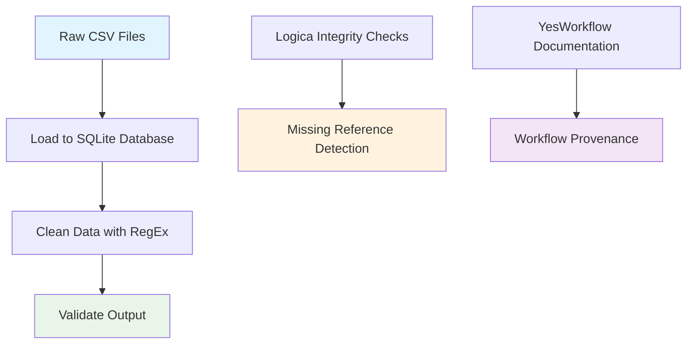

# Data Cleaning Pipeline for NYPL Menu Dataset

This repository implements a **reproducible data cleaning pipeline** for the New York Public Library (NYPL) Menu Dataset, which contains historical restaurant menu data. The pipeline demonstrates the integration of multiple technologies and methodologies for data processing and validation.

## What the Code Does

### 📊 **Dataset Structure**
The pipeline works with four interconnected CSV files representing a relational dataset:

- **[`Menu.csv`](data/Menu.csv:1)** - Contains menu metadata (id, name, sponsor, event, venue, date, etc.)
- **[`MenuPage.csv`](data/MenuPage.csv:1)** - Represents individual pages within menus (page numbers, image references)
- **[`MenuItem.csv`](data/MenuItem.csv:1)** - Individual menu items with pricing and positioning data
- **[`Dish.csv`](data/Dish.csv:1)** - Dish information including names, descriptions, price ranges, and appearance frequency

### 🔄 **Pipeline Workflow**

The pipeline follows a three-stage process:



#### **Stage 1: Data Loading** ([`load_to_sql.py`](scripts/load_to_sql.py:1))
- Loads all four CSV files into a SQLite database ([`menus.db`](scripts/load_to_sql.py:4))
- Creates tables for Menu, MenuPage, MenuItem, and Dish entities
- Enables SQL-based querying and analysis

#### **Stage 2: Data Cleaning** ([`clean_data.py`](scripts/clean_data.py:1))
- Focuses on the [`Dish.csv`](scripts/clean_data.py:4) file
- Applies RegEx-based cleaning to dish names:
  - Converts to lowercase: [`df['name'].str.lower()`](scripts/clean_data.py:5)
  - Removes non-alphabetic characters: [`str.replace(r'[^a-z\s]', '', regex=True)`](scripts/clean_data.py:5)
- Outputs cleaned data to [`Dish_cleaned.csv`](scripts/clean_data.py:6)

#### **Stage 3: Validation** ([`validate_output.py`](scripts/validate_output.py:1))
- Generates a histogram of price distribution from cleaned data
- Creates visualization: [`price_distribution.png`](scripts/validate_output.py:7)
- Provides visual validation of data quality post-cleaning

### 🔍 **Advanced Features**

#### **Logica Integration** ([`integrity_checks.logic`](scripts/integrity_checks.logic:1))
Uses Logica (a logic programming language) for data integrity validation:
- Detects [`missing_dish_reference`](scripts/integrity_checks.logic:3) - menu items that reference non-existent dishes
- Implements declarative logic: [`MenuItem(dish_id: dish_id), not Dish(id: dish_id)`](scripts/integrity_checks.logic:4-5)
- Outputs findings to [`missing_dish_references.csv`](scripts/integrity_checks.logic:7)

#### **YesWorkflow Documentation** ([`pipeline.yw`](workflow/pipeline.yw:1))
Provides workflow provenance and documentation:
- Documents data flow: inputs ([`@in`](workflow/pipeline.yw:2-5)) and outputs ([`@out`](workflow/pipeline.yw:6-8))
- Defines workflow steps: [`Load_CSVs`](workflow/pipeline.yw:10), [`Clean_Dishes`](workflow/pipeline.yw:18), [`Validate_Prices`](workflow/pipeline.yw:23)
- Enables workflow visualization and reproducibility tracking

### 🛠 **Technology Stack**

- **Python**: Core processing with pandas, matplotlib, seaborn
- **SQLite**: Relational data storage and querying
- **RegEx**: Pattern-based text cleaning
- **Logica**: Declarative data integrity checking
- **YesWorkflow**: Workflow provenance and documentation

### 🎯 **Purpose & Use Cases**

This pipeline demonstrates:
1. **Reproducible Data Science**: Clear, documented steps for data processing
2. **Multi-technology Integration**: Combining different tools for comprehensive data handling
3. **Data Quality Assurance**: Multiple validation layers (visual, logical, referential)
4. **Historical Data Processing**: Cleaning and standardizing historical menu data for analysis

The NYPL Menu Dataset likely contains historical restaurant menus with inconsistent formatting, making this cleaning pipeline essential for downstream analysis of food history, pricing trends, and culinary evolution over time.

## How to Run the Pipeline

Follow these steps to execute the complete pipeline:

1. **Install Dependencies**:
   ```bash
   pip install -r requirements.txt
   ```

2. **Load Data to Database**:
   ```bash
   python scripts/load_to_sql.py
   ```

3. **Clean the Data**:
   ```bash
   python scripts/clean_data.py
   ```

4. **Validate Output**:
   ```bash
   python scripts/validate_output.py
   ```

5. **Run Integrity Checks** (Manual):
   - Execute the Logica script manually for referential integrity validation
   - Review the YesWorkflow documentation for workflow provenance

## File Structure

```
data-cleaning-pipeline/
├── data/
│   ├── Menu.csv              # Menu metadata
│   ├── MenuPage.csv          # Menu page information
│   ├── MenuItem.csv          # Individual menu items
│   ├── Dish.csv              # Dish details and statistics
│   └── menus.db              # Generated SQLite database
├── scripts/
│   ├── load_to_sql.py        # Database loading script
│   ├── clean_data.py         # Data cleaning with RegEx
│   ├── validate_output.py    # Output validation
│   └── integrity_checks.logic # Logica integrity checks
├── workflow/
│   └── pipeline.yw           # YesWorkflow documentation
├── requirements.txt          # Python dependencies
└── README.md                 # Project overview
```

This pipeline serves as an excellent example of modern data engineering practices, combining multiple technologies to create a robust, reproducible, and well-documented data processing workflow.