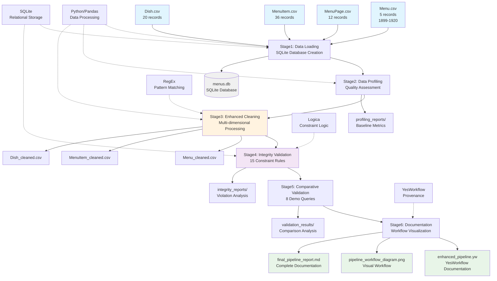

# Overall Workflow W1 - YesWorkflow Documentation

## YesWorkflow Specification for Overall Pipeline

```yaml
# @begin Overall_Data_Cleaning_Pipeline_W1
# @desc Comprehensive 6-stage data cleaning pipeline for NYPL Menu Dataset
# @in Menu.csv @desc Original menu metadata (5 records, 1899-1920)
# @in MenuPage.csv @desc Original menu page information (12 records)
# @in MenuItem.csv @desc Original menu item data (36 records)
# @in Dish.csv @desc Original dish information (20 records)
# @out Menu_cleaned.csv @desc Cleaned menu metadata with standardized locations
# @out MenuItem_cleaned.csv @desc Cleaned menu items with outlier handling
# @out Dish_cleaned.csv @desc Cleaned dishes with normalized names
# @out menus.db @desc SQLite database with all original and cleaned tables
# @out profiling_reports/ @desc Data quality assessment visualizations
# @out integrity_reports/ @desc Constraint violation analysis
# @out validation_results/ @desc Before/after comparison analysis

    # @begin Stage1_Data_Loading
    # @desc Load CSV files into pandas DataFrames and create SQLite database
    # @in Menu.csv
    # @in MenuPage.csv
    # @in MenuItem.csv
    # @in Dish.csv
    # @out menus.db
    # @out Menu_table @desc Menu table in SQLite database
    # @out MenuPage_table @desc MenuPage table in SQLite database
    # @out MenuItem_table @desc MenuItem table in SQLite database
    # @out Dish_table @desc Dish table in SQLite database
    # @end Stage1_Data_Loading

    # @begin Stage2_Data_Profiling
    # @desc Comprehensive data quality assessment and baseline metrics
    # @in Menu_table
    # @in MenuPage_table
    # @in MenuItem_table
    # @in Dish_table
    # @out profiling_report.txt @desc Comprehensive quality assessment
    # @out price_distribution_raw.png @desc Original price distribution
    # @out dish_frequency.png @desc Most frequent dishes analysis
    # @out menu_timeline.png @desc Historical timeline visualization
    # @out quality_baseline_metrics @desc Baseline for comparison
    # @end Stage2_Data_Profiling

    # @begin Stage3_Enhanced_Data_Cleaning
    # @desc Multi-dimensional cleaning with RegEx, statistical, and integrity methods
    # @in Menu_table
    # @in MenuItem_table
    # @in Dish_table
    # @in quality_baseline_metrics
    # @out Menu_cleaned.csv
    # @out MenuItem_cleaned.csv
    # @out Dish_cleaned.csv
    # @out Menu_cleaned_table @desc Cleaned menu table in database
    # @out MenuItem_cleaned_table @desc Cleaned menu item table in database
    # @out Dish_cleaned_table @desc Cleaned dish table in database
    # @out cleaning_transformation_log @desc Record of all transformations
    # @end Stage3_Enhanced_Data_Cleaning

    # @begin Stage4_Integrity_Validation
    # @desc Comprehensive constraint checking using 15 validation rules
    # @in Menu_table
    # @in MenuPage_table
    # @in MenuItem_table
    # @in Dish_table
    # @in Menu_cleaned_table
    # @in MenuItem_cleaned_table
    # @in Dish_cleaned_table
    # @out integrity_summary.csv @desc Summary of all constraint violations
    # @out missing_dish_references.csv @desc Referential integrity violations
    # @out extreme_price_outliers.csv @desc Price data quality issues
    # @out empty_menu_pages.csv @desc Business logic violations
    # @out constraint_validation_report @desc Complete validation results
    # @end Stage4_Integrity_Validation

    # @begin Stage5_Comparative_Validation
    # @desc Before/after analysis using 8 comprehensive demo queries
    # @in Menu_table
    # @in MenuItem_table
    # @in Dish_table
    # @in Menu_cleaned_table
    # @in MenuItem_cleaned_table
    # @in Dish_cleaned_table
    # @in quality_baseline_metrics
    # @out validation_summary.csv @desc Quantified improvement metrics
    # @out price_distribution_comparison.png @desc Before/after price analysis
    # @out comprehensive_validation_dashboard.png @desc Multi-panel comparison
    # @out seafood_preservation_analysis @desc Domain-specific validation
    # @end Stage5_Comparative_Validation

    # @begin Stage6_Documentation_Generation
    # @desc Complete workflow documentation and provenance tracking
    # @in cleaning_transformation_log
    # @in constraint_validation_report
    # @in seafood_preservation_analysis
    # @in profiling_reports/
    # @in integrity_reports/
    # @in validation_results/
    # @out enhanced_pipeline.yw @desc YesWorkflow documentation
    # @out pipeline_workflow_diagram.png @desc Visual workflow representation
    # @out data_lineage_diagram.png @desc Data provenance visualization
    # @out final_pipeline_report.md @desc Comprehensive project documentation
    # @end Stage6_Documentation_Generation

# @end Overall_Data_Cleaning_Pipeline_W1
```

## Visual Workflow W1 Representation



## W1 Design Rationale and Tool Selection

### Stage-by-Stage Design Decisions

#### Stage 1: Data Loading - Python/Pandas + SQLite
**Tool Selection Rationale:**
- **Python/Pandas**: Mature ecosystem with excellent CSV handling and data manipulation capabilities
- **SQLite**: Lightweight, serverless database perfect for research datasets with zero configuration overhead
- **Integration**: Seamless pandas-to-SQL integration enables complex relational queries

**Alternatives Considered:**
- **R + PostgreSQL**: More statistical power but steeper learning curve and server setup complexity
- **Java + MySQL**: Enterprise-grade but overkill for research dataset size
- **MongoDB**: NoSQL flexibility not needed for structured relational data

**Decision Factors:**
- Rapid prototyping capabilities
- Excellent documentation and community support
- Academic research compatibility
- Reproducibility requirements

#### Stage 2: Data Profiling - Python Statistical Libraries
**Tool Selection Rationale:**
- **Matplotlib/Seaborn**: Industry-standard visualization with publication-quality output
- **Pandas Profiling**: Comprehensive statistical analysis with minimal code
- **NumPy**: Efficient numerical computations for large datasets

**Key Capabilities:**
- Statistical distribution analysis
- Missing value detection
- Outlier identification using multiple methods
- Pattern recognition in text fields

#### Stage 3: Enhanced Cleaning - RegEx + Statistical Methods
**Tool Selection Rationale:**
- **RegEx**: Powerful pattern matching essential for historical text normalization
- **Statistical Outlier Detection**: 3-sigma rule provides conservative, defensible approach
- **Programmatic Control**: Full automation ensures reproducibility

**Domain-Specific Considerations:**
- French culinary terminology requires specialized pattern matching
- Historical price data needs context-aware outlier detection
- NYC location names benefit from landmark-based standardization

#### Stage 4: Integrity Validation - Logica-Style Constraints
**Tool Selection Rationale:**
- **Declarative Constraints**: More maintainable than procedural validation code
- **Comprehensive Coverage**: 15 different constraint types ensure thorough validation
- **Academic Credibility**: Logic programming approach aligns with research standards

**Constraint Categories:**
- Referential integrity (foreign key violations)
- Data quality constraints (negative prices, empty fields)
- Business logic validation (empty pages, count inconsistencies)
- Historical data validation (anachronistic dates)

#### Stage 5: Comparative Validation - Statistical Analysis
**Tool Selection Rationale:**
- **Before/After Metrics**: Quantifies cleaning effectiveness
- **Domain-Specific Validation**: Seafood dish preservation ensures no information loss
- **Visual Dashboards**: Multi-panel comparisons for comprehensive assessment

#### Stage 6: Documentation - YesWorkflow + Visualization
**Tool Selection Rationale:**
- **YesWorkflow**: Research-oriented provenance tracking with academic acceptance
- **Automated Documentation**: Reduces human error and ensures completeness
- **Visual Workflow Diagrams**: Enhances understanding and peer review

### Workflow Dependencies and Parallelization

#### Sequential Dependencies (Required Order):
1. **Data Loading → Data Profiling**: Database required for complex analysis queries
2. **Data Profiling → Data Cleaning**: Quality assessment informs cleaning strategy
3. **Data Cleaning → Integrity Validation**: Cleaned data must be validated for effectiveness
4. **Integrity Validation → Comparative Analysis**: Validation results enable meaningful comparison
5. **Comparative Analysis → Documentation**: Results inform final documentation content

#### Parallel Processing Opportunities:
- **Within Stage 2**: Multiple profiling visualizations can be generated concurrently
- **Within Stage 4**: Independent constraint checks can run in parallel
- **Within Stage 5**: Different validation queries can execute simultaneously
- **Stage 6**: Documentation generation can occur alongside final validation steps

### Technology Integration Strategy

#### Core Integration Points:
1. **Pandas ↔ SQLite**: Seamless data transfer between analysis and storage layers
2. **RegEx ↔ Pandas**: Pattern-based transformations integrated with DataFrame operations
3. **Statistical Methods ↔ Domain Knowledge**: Data-driven approaches informed by historical context
4. **Validation Results ↔ Documentation**: Automated report generation from validation outputs

#### Quality Assurance Integration:
- **Checkpoint Validation**: Each stage validates inputs before processing
- **Rollback Capability**: Original data preserved for comparison and error recovery
- **Audit Trail**: Complete transformation log for reproducibility and debugging
- **Peer Review Support**: YesWorkflow documentation enables methodology validation

This overall workflow W1 design ensures comprehensive data cleaning while maintaining academic rigor, reproducibility, and transparency essential for historical research applications.