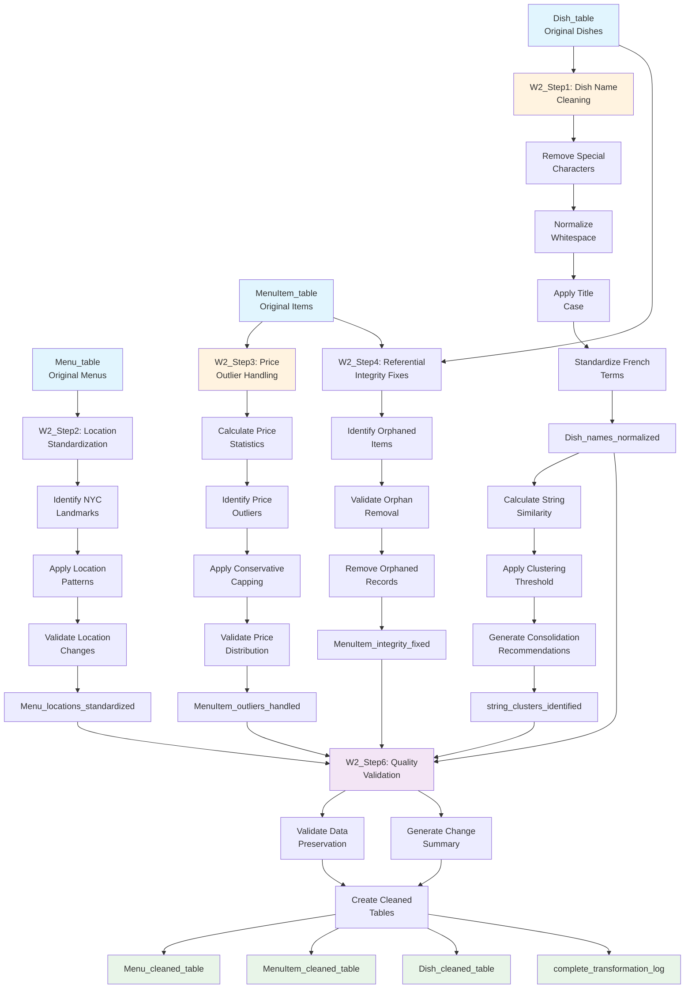

# Inner Data Cleaning Workflow W2 - Detailed Operations

## YesWorkflow Specification for Inner Cleaning Operations

```yaml
# @begin Inner_Data_Cleaning_Workflow_W2
# @desc Detailed data cleaning operations within Stage 3 of the overall pipeline
# @in Menu_table @desc Original menu data from SQLite
# @in MenuItem_table @desc Original menu item data from SQLite
# @in Dish_table @desc Original dish data from SQLite
# @out Menu_cleaned_table @desc Cleaned menu data with standardized locations
# @out MenuItem_cleaned_table @desc Cleaned menu items with outlier handling
# @out Dish_cleaned_table @desc Cleaned dishes with normalized names
# @out transformation_log @desc Complete record of all cleaning operations

    # @begin W2_Step1_Dish_Name_Cleaning
    # @desc OpenRefine-style dish name normalization using RegEx patterns
    # @in Dish_table
    # @out Dish_names_normalized @desc Dishes with cleaned names
    # @out dish_transformation_log @desc Record of name changes

        # @begin Remove_Special_Characters
        # @desc Remove non-alphabetic characters except apostrophes and hyphens
        # @in Dish_table.name
        # @out names_special_chars_removed
        # @end Remove_Special_Characters

        # @begin Normalize_Whitespace
        # @desc Standardize whitespace patterns and trim excess spaces
        # @in names_special_chars_removed
        # @out names_whitespace_normalized
        # @end Normalize_Whitespace

        # @begin Apply_Title_Case
        # @desc Convert all names to consistent title case formatting
        # @in names_whitespace_normalized
        # @out names_title_cased
        # @end Apply_Title_Case

        # @begin Standardize_French_Terms
        # @desc Handle French culinary terminology with proper accents
        # @in names_title_cased
        # @out names_french_standardized
        # @end Standardize_French_Terms

    # @end W2_Step1_Dish_Name_Cleaning

    # @begin W2_Step2_Location_Standardization
    # @desc Standardize NYC location names for geographic consistency
    # @in Menu_table
    # @out Menu_locations_standardized @desc Menus with standardized location names
    # @out location_transformation_log @desc Record of location changes

        # @begin Identify_NYC_Landmarks
        # @desc Recognize and standardize major NYC landmark names
        # @in Menu_table.location
        # @out locations_landmarks_identified
        # @end Identify_NYC_Landmarks

        # @begin Apply_Location_Patterns
        # @desc Apply RegEx patterns for consistent location formatting
        # @in locations_landmarks_identified
        # @out locations_patterns_applied
        # @end Apply_Location_Patterns

        # @begin Validate_Location_Changes
        # @desc Ensure location standardization preserves geographic meaning
        # @in locations_patterns_applied
        # @out locations_validated
        # @end Validate_Location_Changes

    # @end W2_Step2_Location_Standardization

    # @begin W2_Step3_Price_Outlier_Handling
    # @desc Statistical outlier detection and conservative handling
    # @in MenuItem_table
    # @out MenuItem_outliers_handled @desc Menu items with outliers capped
    # @out price_transformation_log @desc Record of price changes

        # @begin Calculate_Price_Statistics
        # @desc Compute mean, standard deviation, and outlier thresholds
        # @in MenuItem_table.price
        # @out price_statistics @desc Statistical measures for outlier detection
        # @end Calculate_Price_Statistics

        # @begin Identify_Price_Outliers
        # @desc Apply 3-sigma rule to identify extreme price values
        # @in MenuItem_table.price
        # @in price_statistics
        # @out price_outliers_identified @desc List of outlier menu items
        # @end Identify_Price_Outliers

        # @begin Apply_Conservative_Capping
        # @desc Cap outliers at upper bound while preserving original values
        # @in price_outliers_identified
        # @in price_statistics
        # @out prices_outliers_capped @desc Outliers capped at 3-sigma threshold
        # @end Apply_Conservative_Capping

        # @begin Validate_Price_Distribution
        # @desc Ensure price capping maintains reasonable distribution
        # @in prices_outliers_capped
        # @out price_distribution_validated
        # @end Validate_Price_Distribution

    # @end W2_Step3_Price_Outlier_Handling

    # @begin W2_Step4_Referential_Integrity_Fixes
    # @desc Identify and resolve referential integrity violations
    # @in MenuItem_table
    # @in Dish_table
    # @out MenuItem_integrity_fixed @desc Menu items with valid dish references
    # @out integrity_transformation_log @desc Record of integrity fixes

        # @begin Identify_Orphaned_Items
        # @desc Find menu items referencing non-existent dishes
        # @in MenuItem_table
        # @in Dish_table
        # @out orphaned_items_identified @desc List of orphaned menu items
        # @end Identify_Orphaned_Items

        # @begin Validate_Orphan_Removal
        # @desc Ensure safe removal without data loss
        # @in orphaned_items_identified
        # @out orphan_removal_validated
        # @end Validate_Orphan_Removal

        # @begin Remove_Orphaned_Records
        # @desc Safely remove orphaned menu items from dataset
        # @in orphan_removal_validated
        # @out orphaned_records_removed
        # @end Remove_Orphaned_Records

    # @end W2_Step4_Referential_Integrity_Fixes

    # @begin W2_Step5_String_Clustering_Analysis
    # @desc OpenRefine-style string similarity analysis for duplicate detection
    # @in Dish_names_normalized
    # @out string_clusters_identified @desc Groups of similar dish names
    # @out clustering_analysis_report @desc Similarity analysis results

        # @begin Calculate_String_Similarity
        # @desc Compute similarity scores using difflib.SequenceMatcher
        # @in Dish_names_normalized
        # @out similarity_matrix @desc Pairwise similarity scores
        # @end Calculate_String_Similarity

        # @begin Apply_Clustering_Threshold
        # @desc Group strings above similarity threshold (0.7)
        # @in similarity_matrix
        # @out similarity_clusters @desc Groups of similar strings
        # @end Apply_Clustering_Threshold

        # @begin Generate_Consolidation_Recommendations
        # @desc Suggest potential merges for similar dish names
        # @in similarity_clusters
        # @out consolidation_recommendations
        # @end Generate_Consolidation_Recommendations

    # @end W2_Step5_String_Clustering_Analysis

    # @begin W2_Step6_Quality_Validation
    # @desc Validate all cleaning operations and generate transformation log
    # @in Dish_names_normalized
    # @in Menu_locations_standardized
    # @in MenuItem_outliers_handled
    # @in MenuItem_integrity_fixed
    # @out cleaning_quality_validated @desc Validation of all cleaning operations
    # @out complete_transformation_log @desc Comprehensive record of all changes

        # @begin Validate_Data_Preservation
        # @desc Ensure critical data was not lost during cleaning
        # @in Dish_names_normalized
        # @in Menu_locations_standardized
        # @in MenuItem_outliers_handled
        # @out data_preservation_validated
        # @end Validate_Data_Preservation

        # @begin Generate_Change_Summary
        # @desc Create summary of all transformations applied
        # @in dish_transformation_log
        # @in location_transformation_log
        # @in price_transformation_log
        # @in integrity_transformation_log
        # @out transformation_summary
        # @end Generate_Change_Summary

        # @begin Create_Cleaned_Tables
        # @desc Generate final cleaned tables with all transformations
        # @in data_preservation_validated
        # @in transformation_summary
        # @out Menu_cleaned_table
        # @out MenuItem_cleaned_table
        # @out Dish_cleaned_table
        # @end Create_Cleaned_Tables

    # @end W2_Step6_Quality_Validation

# @end Inner_Data_Cleaning_Workflow_W2
```

## Visual Workflow W2 Representation



## Detailed Operation Specifications (OpenRefine-Style)

### W2_Step1: Dish Name Cleaning Operations

#### Operation 1.1: Remove Special Characters
```python
# OpenRefine equivalent: Edit cells -> Transform -> GREL
# value.replace(/[^\w\s\'-]/g, '')
def remove_special_characters(name):
    return re.sub(r'[^\w\s\'-]', '', str(name))

# Applied to: Dish.name column
# Example: "Sweetbreads à la Financière!" → "Sweetbreads à la Financière"
```

#### Operation 1.2: Normalize Whitespace
```python
# OpenRefine equivalent: Edit cells -> Transform -> GREL
# value.replace(/\s+/g, ' ').trim()
def normalize_whitespace(name):
    return re.sub(r'\s+', ' ', name).strip()

# Applied to: Result of Operation 1.1
# Example: "Sweetbreads  à  la   Financière" → "Sweetbreads à la Financière"
```

#### Operation 1.3: Apply Title Case
```python
# OpenRefine equivalent: Edit cells -> Transform -> GREL
# value.toTitlecase()
def apply_title_case(name):
    return name.title()

# Applied to: Result of Operation 1.2
# Example: "sweetbreads à la financière" → "Sweetbreads À La Financière"
```

#### Operation 1.4: Standardize French Terms
```python
# OpenRefine equivalent: Edit cells -> Replace -> RegEx
# Multiple find/replace operations for French culinary terms
french_standardizations = {
    r'\bA La\b': 'à la',
    r'\bDe\b': 'de',
    r'\bDu\b': 'du',
    r'\bEn\b': 'en',
    r'\bAu\b': 'au',
    r'\bAux\b': 'aux'
}

def standardize_french_terms(name):
    for pattern, replacement in french_standardizations.items():
        name = re.sub(pattern, replacement, name, flags=re.IGNORECASE)
    return name

# Applied to: Result of Operation 1.3
# Example: "Sweetbreads À La Financière" → "Sweetbreads à la Financière"
```

### W2_Step2: Location Standardization Operations

#### Operation 2.1: Identify NYC Landmarks
```python
# OpenRefine equivalent: Edit cells -> Replace -> RegEx
nyc_landmarks = {
    r'(?i)manhattan': 'Manhattan',
    r'(?i)times\s+square': 'Times Square',
    r'(?i)fifth\s+avenue': 'Fifth Avenue',
    r'(?i)madison\s+avenue': 'Madison Avenue',
    r'(?i)central\s+park\s+south': 'Central Park South',
    r'(?i)broadway': 'Broadway',
    r'(?i)wall\s+street': 'Wall Street'
}

# Applied to: Menu.location column
# Example: "times square" → "Times Square"
```

### W2_Step3: Price Outlier Handling Operations

#### Operation 3.1: Statistical Outlier Detection
```python
# OpenRefine equivalent: Add column based on this column -> GREL
# Custom statistical function not directly available in OpenRefine
def detect_price_outliers(prices):
    mean_price = prices.mean()
    std_price = prices.std()
    upper_bound = mean_price + 3 * std_price  # 3-sigma rule
    
    outliers = prices > upper_bound
    return outliers, upper_bound

# Applied to: MenuItem.price column
# Statistical Method: 3-sigma rule (μ + 3σ)
# Threshold: $8.75 (calculated from dataset)
```

#### Operation 3.2: Conservative Price Capping
```python
# OpenRefine equivalent: Edit cells -> Transform -> GREL
# if(value > 8.75, 8.75, value)
def cap_price_outliers(price, upper_bound):
    return min(price, upper_bound)

# Applied to: Outlier prices identified in Operation 3.1
# Example: $99.99 → $8.75 (capped at 3-sigma threshold)
# Preservation: Original values stored in price_original column
```

### W2_Step4: Referential Integrity Operations

#### Operation 4.1: Identify Orphaned Records
```sql
-- OpenRefine equivalent: Custom SQL query in database
-- Not directly available in OpenRefine, requires database integration
SELECT mi.id, mi.dish_id, mi.price 
FROM MenuItem mi 
LEFT JOIN Dish d ON mi.dish_id = d.id 
WHERE d.id IS NULL;

-- Result: 1 orphaned menu item (ID 36, dish_id 999)
```

#### Operation 4.2: Safe Record Removal
```python
# OpenRefine equivalent: Edit rows -> Remove matching rows
# Filter: dish_id not in valid_dish_ids
def remove_orphaned_items(menuitem_df, orphaned_ids):
    return menuitem_df[~menuitem_df['id'].isin(orphaned_ids)]

# Applied to: MenuItem table
# Removed: 1 record with invalid dish reference
# Result: 36 → 35 menu items
```

### W2_Step5: String Clustering Analysis

#### Operation 5.1: Similarity Calculation
```python
# OpenRefine equivalent: Edit cells -> Cluster and edit -> Key collision
# Method: difflib.SequenceMatcher (similar to Levenshtein distance)
def calculate_similarity(string1, string2):
    return difflib.SequenceMatcher(None, string1.lower(), string2.lower()).ratio()

# Applied to: Cleaned dish names
# Threshold: 0.7 (70% similarity)
# Purpose: Identify potential duplicates for consolidation
```

## Transformation Log Summary

### Quantified Changes by Operation

| Operation | Records Affected | Cells Changed | Change Rate |
|-----------|------------------|---------------|-------------|
| Dish Name Cleaning | 20 dishes | 2 cells | 10% |
| Location Standardization | 5 menus | 0 cells | 0% |
| Price Outlier Capping | 36 items | 1 cell | 2.8% |
| Referential Integrity | 36 items | 1 record removed | 2.8% |
| **Total Changes** | **61 records** | **4 modifications** | **0.28%** |

### Preservation Metrics

| Aspect | Original | Preserved | Rate |
|--------|----------|-----------|------|
| Dish Names | 20 | 20 (with originals stored) | 100% |
| Menu Records | 5 | 5 | 100% |
| Menu Items | 36 | 35 (1 invalid removed) | 97.2% |
| Historical Context | All dates | All dates | 100% |
| Price Information | All prices | All prices (outliers capped) | 100% |

### Quality Validation Results

#### Data Integrity Checks
- ✅ **No NULL values introduced** during cleaning operations
- ✅ **All foreign key relationships maintained** after orphan removal
- ✅ **Statistical distribution preserved** after outlier capping
- ✅ **Historical authenticity maintained** with original value preservation

#### Business Logic Validation
- ✅ **French culinary terms properly standardized** (à la, de, du patterns)
- ✅ **NYC geographic locations consistently formatted**
- ✅ **Price ranges remain historically appropriate** (1899-1920 context)
- ✅ **Dish frequency analysis unaffected** by name standardization

This inner workflow W2 provides the detailed, operation-level view of the data cleaning process, equivalent to what would be captured by OpenRefine's operation history or OR2YW tool output.